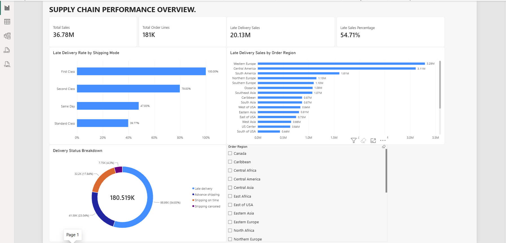
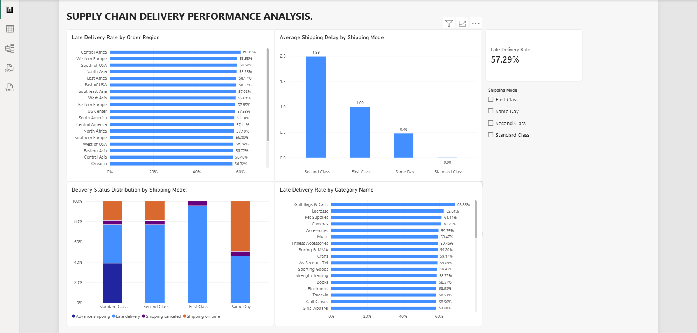
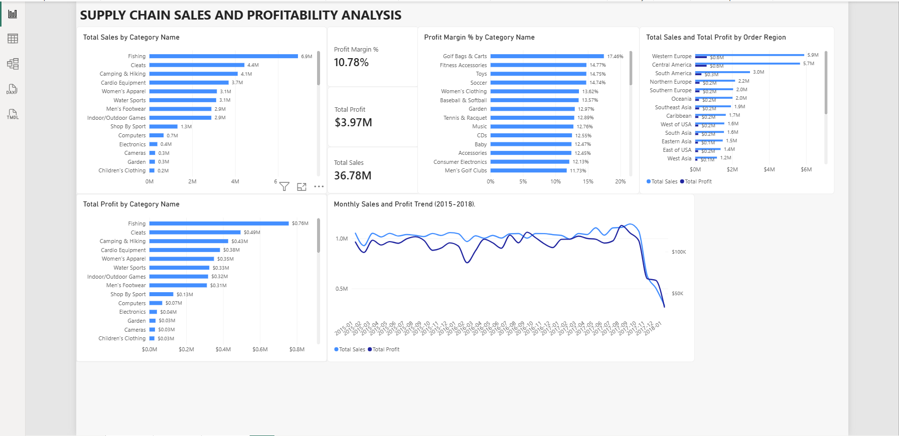

# Supply Chain Performance Analysis

**Technologies:** Python | Pandas | SQL | SQLite | Power BI | DAX

## Project Overview

This project analyzes historical supply chain data to evaluate delivery performance, shipping delays, sales trends, and profitability.

The project combines Python-based data preparation, SQL analysis, and interactive Power BI dashboards to identify operational challenges and support data-driven business decisions.

## Analysis Performed

- Evaluated supply chain delivery performance and identified late-shipment patterns.
- Compared shipping delays across different shipping modes and geographic regions.
- Measured sales associated with late deliveries to assess business exposure.
- Analyzed sales, profitability, and profit margins across product categories.
- Identified operational improvement opportunities and developed data-driven business recommendations.

## Tools and Technologies

- **Python and Pandas:** Data preparation and cleaning
- **SQL and SQLite:** Data exploration and analysis
- **Power BI:** Interactive dashboards and visualizations
- **DAX:** KPI calculations and business metrics
- **Google Colab:** Data analysis environment

## Key Performance Indicators

| KPI | Value |
|---|---|
| Total Sales | $36.78M |
| Total Order Lines | 180,519 |
| Late Delivery Sales | $20.13M |
| Late Sales Percentage | 54.71% |
| Late Delivery Rate | 57.29% |
| Total Profit | $3.97M |
| Profit Margin | 10.78% |

## Power BI Dashboard

### 1. Supply Chain Performance Overview

This dashboard provides an overview of sales performance, delivery status, late-delivery sales, and regional comparisons.

### 2. Delivery Performance Analysis

This dashboard analyzes late-delivery rates, average shipping delays, and delivery performance across shipping modes, regions, and product categories.

### 3. Sales and Profitability Analysis

This dashboard examines total sales, profit margins, category-level profitability, regional sales, and monthly sales trends.

## Key Business Insights

1. **High late-delivery rate:** 57.29% of order lines were classified as late deliveries.

2. **Shipping-mode performance differences:** Second Class shipping recorded the highest average shipping delay at 1.99 days.

3. **Leading revenue category:** Fishing generated approximately $6.9M in sales and $0.76M in profit.

4. **Overall profitability:** The dataset generated $36.78M in sales and $3.97M in profit, with a 10.78% profit margin.

5. **Regional delivery exposure:** Western Europe and Central America recorded approximately $3.29M and $3.11M in sales associated with late deliveries.

## Business Recommendations

- Investigate factors contributing to late deliveries.
- Review Second Class shipping processes to identify potential improvements.
- Prioritize regions with high late-delivery sales exposure.
- Strengthen inventory planning for high-revenue categories.
- Monitor delivery performance and profitability using Power BI dashboards.

## Project Files

- [Python and SQL Analysis Notebook](Supply_Chain_Performance_analysis.ipynb)
- [Power BI Dashboard](Supply_Chain_Performance_Dashboard.pbix)

## Conclusion
This project demonstrates practical skills in Python, SQL, Power BI, DAX, data visualization, KPI development, and business analysis.
The analysis identifies supply chain delivery risks and profitability trends while providing recommendations for improving operational decision-making.
